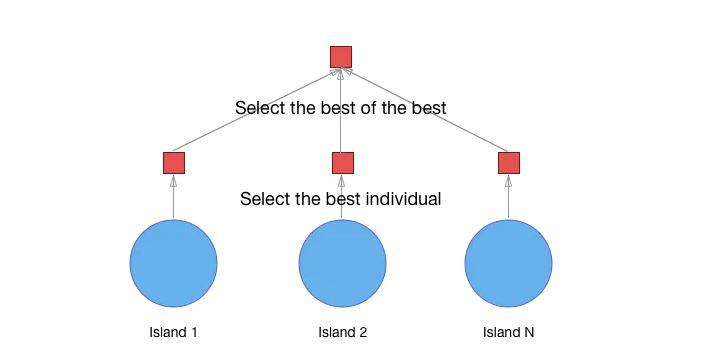

# Parallel Implementation of Genetic Algorithm with Island Model using Multi-Agent Systems

## Table of Contents
- [Understanding the Genetic Algorithm](#understanding-the-genetic-algorithm)
- [Multi-Agent System](#multi-agent-system)
- [Implementation with Island Model](#implementation-with-island-model)
- [Code](#code)
- [References](#references)
## Understanding the Genetic Algorithm

A genetic algorithm is an optimization technique inspired by natural selection and genetic processes. It involves the following key steps:  
+ **Initialization**  
  Create an initial population of individuals (possible solutions) randomly or using a specific strategy.(in the most of cases it's randomly generated)
+ **Fitness Evaluation**  
Evaluate the fitness of each individual in the population based on a fitness function that measures their performance.
+ **Selection**  
Select individuals from the population to form the parent pool for the next generation, typically based on their fitness scores. Better-performing individuals have a higher probability of being selected.
+ **Crossover**  
Generate new individuals by combining the genetic material (chromosomes) of selected parents.
+ **Mutation**  
Introduce random changes into the offspring's genetic information to maintain **genetic diversity** within the population. **Mutation helps explore new areas of the search space.**
+ **Replacement**  
Replace some individuals in the current population with the newly created offspring to form the next generation.
+ **Termination**  
Repeat the steps until a termination condition is met (a satisfactory solution is found, a maximum number of generations is reached).

## Multi-Agent System

 In a multi-agent system, multiple autonomous agents interact with each other to solve a problem collectively. Each agent has its own set of capabilities, knowledge, and behaviors, and they communicate and coordinate their actions to achieve a common goal. In the context of a genetic algorithm, **agents represent individuals** in the population and collaborate to search for optimal solutions.
 

 Agents can communicate and share information with each other, such as fitness values or promising solutions, to improve the overall performance of the genetic algorithm. Collaboration and coordination between agents can lead to more effective exploration and exploitation of the search space.
 

The combination of genetic algorithms and multi-agent systems can potentially enhance the performance of the optimization process by parallelizing computations and facilitating information sharing and cooperation between agents. 

## Implementation with Island Model

 The island model is a parallelization technique used in genetic algorithms (GAs) to improve their performance and search capabilities. In a traditional GA, a population of candidate solutions evolves over generations through the application of genetic operators such as selection, crossover, and mutation. The island model introduces multiple subpopulations, or "islands" that evolve independently in parallel.
Each island in the model maintains its own population and performs genetic operations locally. 
 

<figure>
  
  <figcaption align="center">Parallel genetic algorithm</figcaption>
</figure>

In our case we will use the platform jade in java to implements this model.
- **TARGET_SOLUTION**:the sequence of characters: "Bonjour Manar"
- **CHROMOSOME_SIZE**: 13
- **POPULATION_SIZE**: 20
- **MUTATION_PROBABILITY**: 0.1
- **MAX_ITERATION**: 1000
- **ISLAND_NUMBER**: 5

we have two agent classes:  
+ **IslandAgent**: Represents each island in the island model. Each IslandAgent will have its own subpopulation and will evolve independently. 
+ **MasterAgent**: Represents the master agent responsible for coordinating the island agents and selecting the best solutions.

The **MasterAgent**  have a CyclicBehaviour that waits for incoming ACL messages from the IslandAgents. 

Once the MasterAgent has received messages from all the IslandAgents, he can print the top 5 solutions in the console as follows. 

## Code
* **GAUtils.java**
  

* **IslandAgent.java**
  
* **MasterAgent.java**
  
* **Individual.java**
  
* **MainContainer.java**  
  
* **SimpleContainer.java**
  

## References
[Parallel and distributed genetic algorithms Published in Towards Data Science](https://towardsdatascience.com/parallel-and-distributed-genetic-algorithms-1ed2e76866e3 )

